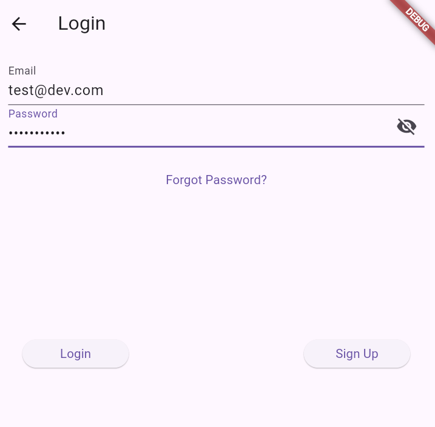

# Expense Tracker

A personal finance management application built with Flutter to help users track their expenses and manage budgets effectively.

## Features

- User authentication (Login/Signup)
- Add and manage transactions
- View transaction history
- Monthly expense reports
- Budget tracking and management
- Dashboard with financial overview

## Screenshots




## Getting Started

### Prerequisites

- Flutter SDK installed
- Dart SDK installed
- Android Studio or VS Code with Flutter extension

### Installation

1. Clone the repository:
   ```bash
   git clone https://github.com/Garrisoncraft/expensetracker.git
   ```

2. Navigate to the project directory:
   ```bash
   cd tracker
   ```

3. Install dependencies:
   ```bash
   flutter pub get
   ```

4. Run the application:
   ```bash
   flutter run
   ```

## Usage

1. Create an account or login if you already have one
2. Add your income and expenses through the transaction screen
3. View your financial overview on the dashboard
4. Check monthly reports for detailed expense analysis
5. Set and track your budget goals

## Contributing

Contributions are welcome! Please follow these steps:

1. Fork the project
2. Create your feature branch (`git checkout -b feature/AmazingFeature`)
3. Commit your changes (`git commit -m 'Add some AmazingFeature'`)
4. Push to the branch (`git push origin feature/AmazingFeature`)
5. Open a Pull Request

## Resources

- [Flutter Documentation](https://flutter.dev/docs)
- [Dart Language Tour](https://dart.dev/guides/language/language-tour)
